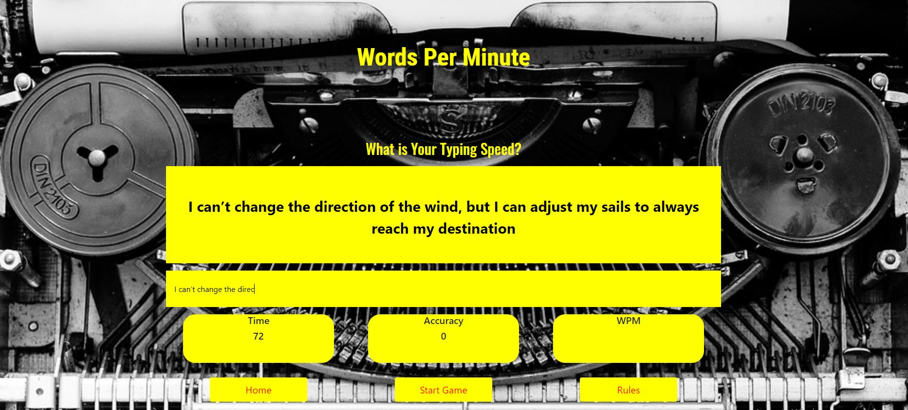

## Typing Game


[View the live project here.](link)

This is a speed typing game, where the user can practice and improve their typing speed. It calculates both how many words per minute the user can type, as well as the accuracy to which they type it.



## User Experience (UX)

- User Stories

  - First Time Visitor Goals

    - As a first time visitor, I want to easily navigate the site.
    - As a first time visitor, I want to be able to test my typing speed.

 - Casual Users    
     - As a casual user, I would like to try out a simple game.
     - As a casual user, I would like to test my typing speed.

 - Office Users
    - As an office worker, I would like to develop my typing speed.

 - Teachers
    - As a teacher, I would like to use the site to develop the typing speeds of my students.


- Design

  - Colour Scheme

    - The colour scheme of this project is black, yellow and red. This gives the site a clear, contrasting aesthetic while making it easy to undertake the game. 

  - Typography

    - There have been three fonts used in this project: xxxx
      - xx was used for xx
      - xxx was used for xxx
      - xx was used for xxx

  - Imagery

    - The only image used for this project was for the background. This image of a typewriter makes for an interesting and related backdrop. 

  - Wireframes
    - [Desktop](./assets/images/wireframes/desktop)
    - [Mobile](./assets/images/wireframes/mobile)

## Features

- Responsive across all devices
  - The game is designed to be played on desktops, however it is possible to play on mobile devices. While played on mobile, the device should be held landscape. Due to the nature of mobile keyboards, reading the phrase to type may be challenging.


## Technologies Used

- Languages Used
  - [HTML 5](https://en.wikipedia.org/wiki/HTML5)
  - [CSS3](https://en.wikipedia.org/wiki/Cascading_Style_Sheets)
  - [JavaScript](https://en.wikipedia.org/wiki/JavaScript)
- Frameworks, Libraries and Programs Used
  - [Bootstrap 4.5.2](https://getbootstrap.com/):
    - Bootstrap was used to assist with the responsiveness and styling of the website.
  - [Google Fonts](https://fonts.google.com/):
    - Google fonts were used to import the 'ASAP', ‘Lobster’ and ‘Oswald’ fonts into the style.css file which are used throughout this project.
  - [Git](https://git-scm.com/):
    - Git was used for version control by utilizing the Gitpod terminal to commit to Git and Push to GitHub.
  - [GitHub](https://github.com/):
    - GitHub is used to store the projects code after being pushed from Git.
  - [Balsamiq](https://balsamiq.com/):
    - Balsamiq was used to create the wireframes during the design process.

## Testing

  - First Time Visitor Goals

    - As a first time visitor, I want to easily navigate the site.
        - The site is clear, as it only has limited pages. The links to each page are cleatly marked.
    - As a first time visitor, I want to be able to test my typing speed.
        - During and on completion of the game, the site shows the users typing speed and accuracy.

- Casual Users, Office Users and Teachers

    - The functionality remains the same across ass user groups. The site can be used as a casual bit of fun, to a useful skills development tool.     

- Timer
     - To test the timer, it was displayed using innerHTML to display the output, then run in the local port to ensure functionality.9o0

- Accuracy
     - To test the calculate accuracy function, the displayed excerpt was copied and pasted into the input field. This should return a result of 100%. Then, various correct and incorrect inputs were typed to ensure the accuracy displayed is accurate.

- console.log()
    - consol.log() was used at various stages of the project to ensure the functions work correctly. For example, to ensure the user input is captured correctly, and each word is split into an object of an array, console.log() was used to print the user input to the console

### Further Testing

- The website was tested across multiple browsers, including Google Chrome, Firefox, Opera and Safari.
- The website was trailed on a range of devices of different sizes, including monitors, laptops, tablets and phones.
- The content has been run through spell checks.
- All links were checked to ensure they are active.


### Known Issues

- Functionality on mobile is diminished due to the nature of the project

 ### Validation

- The [W3C Markup Validator](https://jigsaw.w3.org/css-validator/#validate_by_input) and [W3C CSS Validator](https://jigsaw.w3.org/css-validator/#validate_by_input) were used to validate each page of the site.
- Each page had various errors that needed to be fixed. The details of each test can be found below:
  - Home Page - [Test]() [Validated]()
  - 

 ### Formatting

- To format the code, each page was run through an online formatter, https://www.freeformatter.com/.

## Deployment

### GitHub Pages

The project was deployed to GitHub Pages using the following steps...

1. Log in to GitHub and locate the GitHub Repository
2. At the top of the Repository (not top of page), locate the "Settings" Button on the menu.
   - Alternatively Click Here for a GIF demonstrating the process starting from Step 2.
3. Scroll down the Settings page until you locate the "GitHub Pages" Section.
4. Under "Source", click the dropdown called "None" and select "Master Branch".
5. The page will automatically refresh.
6. Scroll back down through the page to locate the now published site link in the "GitHub Pages" section.

### Forking the GitHub Repository

By forking the GitHub Repository we make a copy of the original repository on our GitHub account to view and/or make changes without affecting the original repository by using the following steps...

1. Log in to GitHub and locate the GitHub Repository
2. At the top of the Repository (not top of page) just above the "Settings" Button on the menu, locate the "Fork" Button.
3. You should now have a copy of the original repository in your GitHub account.

### Making a Local Clone

1. Log in to GitHub and locate the GitHub Repository
2. Under the repository name, click "Clone or download".
3. To clone the repository using HTTPS, under "Clone with HTTPS", copy the link.
4. Open Git Bash
5. Change the current working directory to the location where you want the cloned directory to be made.
6. Type git clone, and then paste the URL you copied in Step 3.

```
$ git clone https://github.com/YOUR-USERNAME/YOUR-REPOSITORY
```

7. Press Enter. Your local clone will be created.

```
$ git clone https://github.com/YOUR-USERNAME/YOUR-REPOSITORY
> Cloning into `jifsrescue-clone`...
> remote: Counting objects: 10, done.
> remote: Compressing objects: 100% (8/8), done.
> remove: Total 10 (delta 1), reused 10 (delta 1)
> Unpacking objects: 100% (10/10), done.
```

Click [Here](https://help.github.com/en/github/creating-cloning-and-archiving-repositories/cloning-a-repository#cloning-a-repository-to-github-desktop) to retrieve pictures for some of the buttons and more detailed explanations of the above process.

## Credits

### Code

- The project was inpired by, and adapted from https://www.geeksforgeeks.org/design-a-typing-speed-test-game-using-javascript/
- The code for the vut the project to help with responsiveness, the grid system and other elements such as the navbar.

### Content

- All content was written by the developer except where credited.

### Media

- All images were sourced royalty free from https://pixabay.com/


### Acknowledgments

- Thanks to my Code Institute tutor, who provided support throughout the duration of this project.
- Thanks to my Code Institute mentor, who provided ideas and feedback at pivotal stages of this project.
- Thanks to my parents, friends and colleagues who providing constructive criticisms and support.
- I used the Code Institute source material and various blog posts for issues with the code.


`python3 -m http.server`

